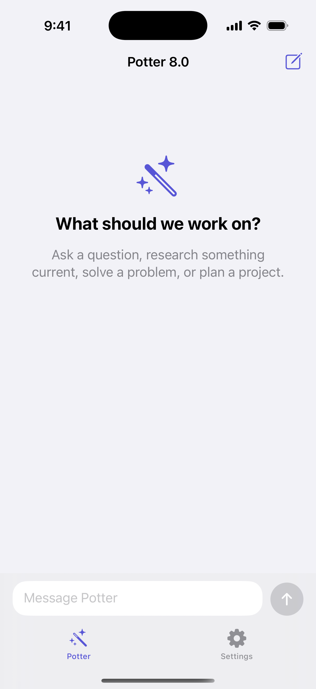

# Potter 8.0

Potter 8.0 is an open-source AI agent that runs in a Python terminal and can
also power a native SwiftUI iPhone/iPad chat app. Its model picker supports
OpenAI GPT-5.6, Claude Fable 5, Kimi K3, Grok 4.5, Gemini 3.1 Pro, a
Fable-powered Claude Code mode, and a genuinely free local Ollama model.

OpenAI mode uses the OpenAI Agents SDK, keeps response continuation state,
searches the web, calculates, reads workspace files, and routes research,
analysis, and coding work to focused specialists. Other provider modes keep
separate local text histories and use their chat/vision APIs.

The default reasoning effort is `high` for quality-first work. This increases
latency and API usage compared with `medium` or `low`.

It is an agent framework, not a claim of human intelligence or guaranteed
accuracy. Important output and actions should still be reviewed.

## iOS preview



## What is included

- Interactive terminal chat and one-shot `ask` mode.
- Research, analysis, and builder specialists.
- OpenAI web search plus safe math, time, file-list, and file-read tools.
- Optional file writes and subprocesses in CLI mode only.
- Per-action approval for every write or command.
- Local authenticated HTTP bridge for the included SwiftUI app.
- In-app AI model picker with separate conversation state for every model.
- Server-only provider keys; no provider credential is stored in the IPA.
- Free local vision chat through Ollama and `gemma3:4b`.
- Up to four photo attachments per iOS message, with real multimodal analysis.
- Local conversation continuation, iOS chat history, tests, and MIT license.

## Fastest terminal setup

Requirements: Python 3.11+. OpenAI mode additionally needs an OpenAI Platform
API key; free local mode needs [Ollama](https://ollama.com/download).

```bash
cd potter-8.0
python3 -m venv .venv
source .venv/bin/activate
python -m pip install -e .
export OPENAI_API_KEY="paste_your_key_here"
potter chat
```

The official setup uses the `OPENAI_API_KEY` environment variable; do not paste
the key into `potter.py`, the iOS app, chat, or GitHub. OpenAI API usage is
billed through the Platform account and is separate from a ChatGPT subscription. See the official
[SDK setup](https://developers.openai.com/api/docs/libraries) and
[production security guidance](https://developers.openai.com/api/docs/guides/production-best-practices).

You can also run the single Python file directly:

```bash
python -m pip install openai-agents
export OPENAI_API_KEY="paste_your_key_here"
python potter.py
```

On Windows PowerShell:

```powershell
py -m venv .venv
.venv\Scripts\Activate.ps1
py -m pip install -e .
$env:OPENAI_API_KEY="paste_your_key_here"
potter chat
```

## Terminal commands

```bash
# Interactive chat
potter chat

# One question, then exit
potter ask "Research the newest battery technology and cite sources"

# Maximum reasoning for a particularly hard task (slower and more expensive)
potter --reasoning max ask "Audit this migration plan for hidden failure modes"

# Give Potter access to a particular project
potter --workspace /absolute/path/to/project chat

# Enable write requests; Potter still asks before every write
potter --workspace /absolute/path/to/project chat --allow-writes

# Enable argument-list commands; Potter still asks before every command
potter --workspace /absolute/path/to/project chat --allow-shell

# Forget a saved continuation
potter reset --session cli
```

Inside interactive chat, use `/models`, `/model`, `/new`, `/reset`, `/help`,
or `/exit`.

Use `/models` to list every AI choice and `/model <id>` to switch without
restarting Potter. For example:

```text
/model google-gemini-3.1-pro
/model ollama-local-free
```

The OpenAI Agents SDK runs the repeated tool loop and continuation flow. Potter
uses the documented `previous_response_id` strategy rather than replaying and
duplicating local history. See the official
[Agents SDK overview](https://developers.openai.com/api/docs/guides/agents) and
[running-agents guide](https://developers.openai.com/api/docs/guides/agents/running-agents).

## AI choices and cost

| Picker choice | Potter ID | Server setup | Access |
| --- | --- | --- | --- |
| OpenAI GPT-5.6 | `openai-gpt-5.6` | `OPENAI_API_KEY` | Paid API |
| Claude Fable 5 | `anthropic-fable-5` | `ANTHROPIC_API_KEY` | Paid API |
| Kimi K3 | `moonshot-kimi-k3` | `MOONSHOT_API_KEY` | Paid hosted API; open-weight model |
| Grok 4.5 | `xai-grok-4.5` | `XAI_API_KEY` | Paid API |
| Gemini 3.1 Pro | `google-gemini-3.1-pro` | `GEMINI_API_KEY` | Limited free API tier available |
| Claude Code | `anthropic-claude-code` | `ANTHROPIC_API_KEY` | Paid Fable 5 coding mode |
| Potter Local | `ollama-local-free` | Ollama + `gemma3:4b` | Free on your computer |

Claude Code in the Potter picker is an accurately labeled coding-focused chat
mode powered by Fable 5. It is not Anthropic's separate Claude Code CLI or cloud
routines product and cannot edit your computer through the iOS server.

No software can legally make the paid proprietary APIs unlimited and free.
Potter does not bypass billing, share keys, or include hidden credentials.

### Free local setup

Install Ollama, then paste these commands into Terminal:

```bash
ollama pull gemma3:4b
potter serve --host 0.0.0.0
```

Select **Potter Local** in the iOS app. No AI API key is required. You can use a
different installed Ollama model with `POTTER_OLLAMA_MODEL`, and a remote Ollama
computer with `OLLAMA_BASE_URL`.

### Gemini free-tier setup

Create your own Gemini API key, then keep it only in the server terminal:

```bash
export GEMINI_API_KEY="paste_your_private_key_here"
potter serve --host 0.0.0.0
```

Select **Gemini 3.1 Pro** in Potter. Google's free-tier limits and availability
still apply.

## Run the iOS backend

The iOS app never contains provider API keys. Start Potter on the Mac or other
computer that owns any keys you want to use:

```bash
source .venv/bin/activate
export OPENAI_API_KEY="paste_your_key_here"
potter serve --host 0.0.0.0
```

The server prints two values needed by the app:

- A URL such as `http://Your-Mac.local:8787`.
- A random local access token.

The access token protects the local bridge; it is not a provider API key. The
server disables shell and file-write tools in iOS/HTTP mode. Use this only on a
trusted local network and stop it with Ctrl-C when finished.

For a stable token across restarts:

```bash
export POTTER_SERVER_TOKEN="choose-a-long-random-token"
potter serve --host 0.0.0.0
```

## Build the SwiftUI app

Requirements: macOS, Xcode, and XcodeGen. The app targets iOS 17+.

```bash
cd ios/Potter8
xcodegen generate
open Potter8.xcodeproj
```

In Xcode:

1. Select the `Potter8` target and choose your Apple development team.
2. Change the bundle identifier if `com.potter8.app` is unavailable.
3. Run on an iPhone or Simulator.
4. Open Settings in the app and enter the server URL and printed access token.
5. Tap **Test connection**, then choose an AI model in Settings or by tapping
   the model name under **Potter 8.0** in chat.

In chat, tap the photo button beside the message field to attach up to four
images. Potter creates lightweight previews on-device, sends the resized images
through your authenticated local server, and passes them to the model as vision
inputs. Selected photos are not sent until you tap the send button.

For Simulator use `http://127.0.0.1:8787`. For a physical iPhone, use the
printed `.local` address and allow Local Network access. The app enables only
local-network HTTP while leaving App Transport Security enabled elsewhere, in
line with Apple's
[NSAllowsLocalNetworking documentation](https://developer.apple.com/documentation/bundleresources/information-property-list/nsapptransportsecurity/nsallowslocalnetworking).

### Private IPA without owning a Mac

The repository includes a manual GitHub Actions workflow that compiles an
unsigned IPA on a hosted macOS runner. You can then sign and install it locally
with your own Apple Account. Follow [PRIVATE_IPA.md](PRIVATE_IPA.md). Free Apple
signing expires after seven days, so this route requires a weekly refresh.

## Local API

Health check:

```bash
curl http://127.0.0.1:8787/health
```

Chat request:

```bash
curl http://127.0.0.1:8787/v1/chat \
  -H "Authorization: Bearer $POTTER_SERVER_TOKEN" \
  -H "Content-Type: application/json" \
  -d '{"session_id":"demo","message":"What can you do?"}'
```

The optional `images` field accepts up to four Base64-encoded JPEG, PNG, WEBP,
or non-animated GIF inputs. Each decoded image is limited to 4 MiB. The iOS app
automatically resizes and converts selected photos before sending them.

Endpoints:

| Method | Path | Purpose |
| --- | --- | --- |
| `GET` | `/health` | Server, version, and default-model status |
| `GET` | `/v1/models` | Authenticated model catalog and configuration status |
| `POST` | `/v1/chat` | Send one message in a named session |
| `POST` | `/v1/reset` | Forget one named session |

## Safety model

- All file paths are resolved inside `POTTER_WORKSPACE`; traversal and symlink
  escapes are blocked.
- Text reads are size-limited.
- Calculation uses a restricted syntax tree, never Python `eval`.
- Writes and commands are disabled by default.
- CLI writes/commands require an enable flag and a fresh terminal confirmation.
- Commands use an argument list with `shell=False` and receive an environment
  stripped of variables with key/token/secret/password-like names.
- HTTP/iOS mode cannot execute commands or write files.
- HTTP image inputs are count-, size-, Base64-, signature-, and MIME-validated.
- The iOS app stores the local bridge token in Keychain.

Read [SECURITY.md](SECURITY.md) before extending Potter with consequential tools.

## Configuration

| Variable | Default | Meaning |
| --- | --- | --- |
| `OPENAI_API_KEY` | optional | OpenAI GPT-5.6 key for Python only |
| `ANTHROPIC_API_KEY` | optional | Fable 5 and Claude Code-mode key |
| `MOONSHOT_API_KEY` | optional | Kimi K3 key |
| `XAI_API_KEY` | optional | Grok 4.5 key |
| `GEMINI_API_KEY` | optional | Gemini 3.1 Pro key; free tier may apply |
| `POTTER_MODEL` | `openai-gpt-5.6` | Default Potter model ID |
| `POTTER_REASONING` | `high` | Reasoning effort: `none` through `max` |
| `POTTER_WORKSPACE` | current directory | Root available to file tools |
| `POTTER_DATA_DIR` | `~/.potter8` | Local continuation-ID storage |
| `POTTER_SERVER_TOKEN` | random per run | Local HTTP bearer token |
| `POTTER_OLLAMA_MODEL` | `gemma3:4b` | Installed local Ollama model |
| `OLLAMA_BASE_URL` | `http://127.0.0.1:11434` | Ollama server base URL |

Use a lower-cost model by setting `POTTER_MODEL` before launch, provided that
model supports the tools you enable.

## Tests

The core safety and persistence tests do not need an API key:

```bash
python3 -m unittest discover -s tests -v
```

An actual model response is not run automatically because it would require
your API key and incur API usage.

## Open source

Potter 8.0 is released under the [MIT License](LICENSE). Contributions are
welcome; see [CONTRIBUTING.md](CONTRIBUTING.md). The Potter source is open
source; the hosted OpenAI models/API are external services and are not included
under Potter's MIT license.
